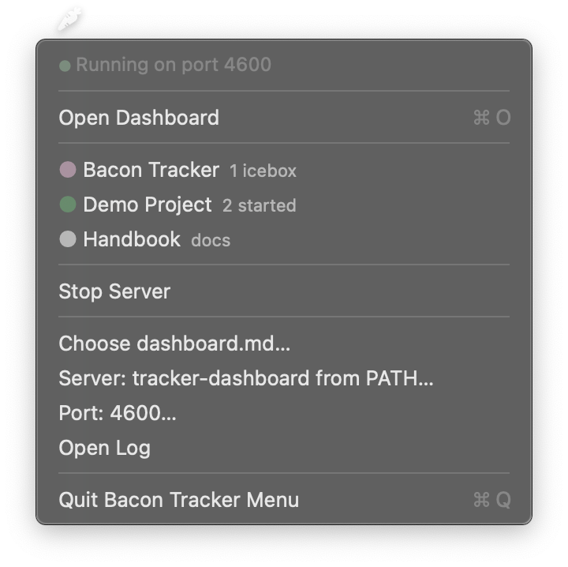

# BaconTrackerMenu

A macOS menu bar app that runs your [bacon-tracker](https://github.com/bybacon/bacon-tracker) dashboard server and puts every project's board one click away.

It starts `tracker-dashboard` for you, shows each project with its workload at a glance, and stops the server when you quit. Nothing else changes: the tracker is still plain files in your repositories.



## Requirements

| Requirement | Version | Notes |
|---|---|---|
| macOS | 13 Ventura or later | |
| [bacon-tracker](https://github.com/bybacon/bacon-tracker) | 1.0 or later | `gem install bacon-tracker` |
| Xcode | 15 or later | Only to build from source (Swift 5.9+) |

Any Ruby setup works: rbenv, asdf, mise, chruby, rvm or Homebrew. The app starts the server through your login shell, the same way a new Terminal window would, so whatever puts `ruby` and `tracker-dashboard` on your PATH there applies here too.

## Installation

There is no signed download yet. Build it from source:

```bash
git clone https://github.com/bybacon/bacon-tracker-menu.git
cd bacon-tracker-menu
make install        # builds, bundles and copies to ~/Applications
open ~/Applications/BaconTrackerMenu.app
```

The other targets:

```bash
make build          # .build/release/BaconTrackerMenu
make test           # unit tests
make app            # BaconTrackerMenu.app in this directory, ad-hoc signed
```

`make app` signs the bundle ad hoc, which is enough to run what you built yourself. If you copy the app to another Mac, Gatekeeper will block it because it is not notarized. Build it on that Mac instead.

The app has no Dock icon. A carrot appears in the menu bar: outlined while the server is stopped or starting, filled once it answers.

## Setup

1. **Install bacon-tracker** and create a dashboard, if you haven't:

   ```bash
   gem install bacon-tracker
   tracker-init --path ~/projects/my-app --namespace APP --title "My App" --yes
   ```

   This writes `dashboard.md` in the current directory.

2. **Choose the dashboard.** Menu → **Choose dashboard.md…**. On first launch the app looks for `~/dashboard.md` and `~/.bacon/dashboard.md` on its own.

That's it. The server starts and the menu lists your projects.

The app finds `tracker-dashboard` on your PATH. To run bacon-tracker from a git checkout instead, choose **Server: … → bin/tracker-dashboard** inside the checkout. A checkout is run with `bundle exec` from its own directory. **Use tracker-dashboard from PATH** switches back.

## The menu

- **Status line**: Starting, Running on port 4567, or Stopped with the reason when the server exited or could not start.
- **Open Dashboard** (⌘O): the multi-project overview.
- **One item per project**: the dot shows the workload. Green means work is started, rose means there is a backlog, and muted rose means only icebox. Grey means empty or docs only. Hover for the next backlog item. Clicking opens the project's board, or its docs for a project without a tracker.
- **Start / Stop Server**
- **Choose dashboard.md…**, **Server: …**, **Port: 4567…**: settings, saved between launches.
- **Open Log**: the server's output.

Stats refresh every 30 seconds while the server runs, and again whenever you open the menu. The open menu updates in place.

## `dashboard.md`

The same file `tracker-dashboard` reads, written by `tracker-init`:

```markdown
## My App
path: ~/projects/my-app
namespace: APP
```

`path` is the project directory, which holds `tracker/` and optionally `docs/`. See the [bacon-tracker README](https://github.com/bybacon/bacon-tracker#dashboardmd) for the optional keys.

## Troubleshooting

The menu shows why the server stopped. The full output is in the log, opened from the menu, or:

```bash
tail -f ~/Library/Logs/BaconTrackerMenu/bacon-tracker-menu.log
```

The log is rotated at 1 MB. One previous file is kept as `bacon-tracker-menu.log.1`.

| Message | What to do |
|---|---|
| tracker-dashboard was not found on your shell's PATH | `gem install bacon-tracker`, then open a new Terminal and check that `which tracker-dashboard` finds it. |
| Port 4567 is in use by another process | Something else is listening there. Stop it, or pick another port in the menu. |
| The server did not answer within 45 seconds | Open the log. Usually a Ruby or gem error at boot. |
| Server exited (status 1): … | The last log line is shown. The log has the rest. |

If the app ever quits without stopping its server, the next launch recognises that server and replaces it. It never stops a process it did not start.

## How it works

1. The app reads `dashboard.md` so the menu can list projects before the server is up.
2. It starts `tracker-dashboard --dashboard <file> --port <port>` through your login shell, as an interactive login shell so your usual shell setup applies.
3. It polls `GET /api/stats` until the server answers, then marks it running and keeps the stats fresh.
4. Clicking a project opens `http://localhost:<port>/projects/<slug>` in your browser.
5. Quitting the app stops the server.

## Development

```bash
swift build
swift test
```

`Sources/BaconTrackerMenuCore` holds everything that can be tested without AppKit or a live process: the launch command, `dashboard.md`, the stats payload, port ownership and the log. `Sources/BaconTrackerMenu` is the menu and process management. See [CONTRIBUTING.md](CONTRIBUTING.md) before opening a pull request.

## License

[MIT](LICENSE)
